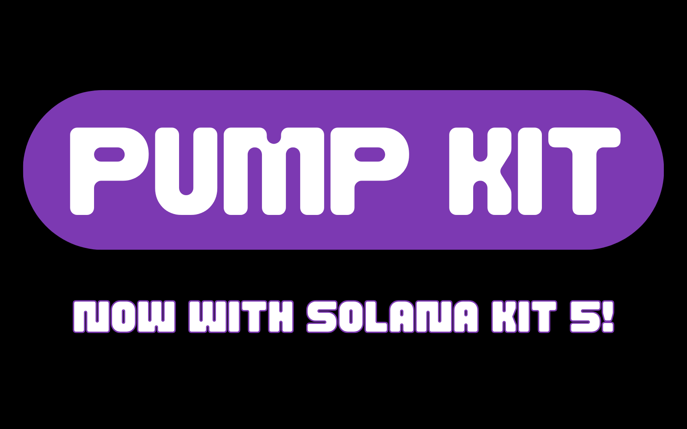

# Pump Kit

<p align="center">
  
</p>

<p align="center">
  <a href="https://www.npmjs.com/package/pump-kit">
    
  </a>
  <a href="https://bun.sh">
    = 1.3.0" />
  </a>
  <a href="https://nodejs.org/en">
    = 20" />
  </a>
</p>

A TypeScript SDK for Pump.fun built on **Solana Kit 5.0**. Designed for high-performance applications including launch bots, bundlers, and low-latency trading systems using latest Solana best practices. 

**Production-ready package coming soon.**

## Features

- **Solana Kit 5.0** – Built on the latest Solana development framework
- **Modern transaction patterns** – Optimized for speed and reliability
- **Human-readable API** – Work with SOL amounts and percentages instead of raw lamports
- **Automatic slippage protection** – Built-in guards for buy/sell operations
- **Launch capabilities** – Create and buy tokens in one atomic transaction
- **Liquidity operations** – Add/remove liquidity with simple helpers
- **Full TypeScript support** – Strongly typed throughout with complete type coverage

---

## Installation

```bash
bun add pump-kit
```

---

## Quick Start

### Setup

```ts
import { createSolanaRpc } from "@solana/kit";

const rpc = createSolanaRpc("https://api.mainnet-beta.solana.com");
```

### Buy Tokens

```ts
import { buy } from "pump-kit";

await buy({
  user: myWallet,
  mint: "TokenMintAddress",
  solAmount: 0.5,        // 0.5 SOL
  slippageBps: 50,       // 0.5% slippage (optional)
  rpc,
});
```

### Sell Tokens

```ts
import { sell } from "pump-kit";

// Sell specific amount
await sell({
  user: myWallet,
  mint: "TokenMintAddress",
  tokenAmount: 125_000,
  rpc,
});

// Sell percentage of wallet
await sell({
  user: myWallet,
  mint: "TokenMintAddress",
  useWalletPercentage: true,
  walletPercentage: 40,  // Sell 40% of holdings
  rpc,
});
```

### Create and Buy Token

```ts
import { mintWithFirstBuy } from "pump-kit";
import { generateKeyPair } from "@solana/kit";

const mintKeypair = await generateKeyPair();

const { createInstruction, buyInstruction } = await mintWithFirstBuy({
  user: myWallet,
  mint: mintKeypair,
  mintAuthority: myWallet.address,
  name: "My Token",
  symbol: "MTK",
  uri: "https://arweave.net/metadata.json",
  firstBuyTokenAmount: 1_000_000,
  firstBuySolBudget: 1.0,
  rpc,
});
```

### Quick Helpers

```ts
import { quickBuy, quickSell } from "pump-kit";

// Get buy instruction
const buyIx = await quickBuy(myWallet, "TokenMint", 0.25, { rpc });

// Get sell instruction
const sellIx = await quickSell(myWallet, "TokenMint", 100_000, { rpc });
```

---

## API Reference

### Core Functions

```ts
// Buy tokens
buy({ user, mint, solAmount, slippageBps?, rpc, ... })

// Sell tokens
sell({ user, mint, tokenAmount?, useWalletPercentage?, walletPercentage?, rpc, ... })

// Quick helpers (return instructions only)
quickBuy(wallet, mint, solAmount, { rpc, ...options })
quickSell(wallet, mint, tokenAmount, { rpc, ...options })

// Create token with initial buy
mintWithFirstBuy({ user, mint, name, symbol, uri, firstBuyTokenAmount, firstBuySolBudget, rpc, ... })
```

### Liquidity Management

```ts
// Add liquidity to pool
addLiquidity({ user, baseMint, quoteMint?, maxBaseAmountIn, maxQuoteAmountIn, rpc, ... })

// Remove liquidity from pool
removeLiquidity({ user, baseMint, quoteMint?, lpAmountIn, rpc, ... })
```

### Transaction Utilities

```ts
// Build transaction
buildTransaction({ instructions, payer, prependInstructions?, appendInstructions?, rpc })

// Send and confirm
sendAndConfirmTransaction({ instructions, payer, rpc, rpcSubscriptions, ... })

// Simulate transaction
simulateTransaction({ instructions, payer, rpc, options? })
```

---

## License

MIT
